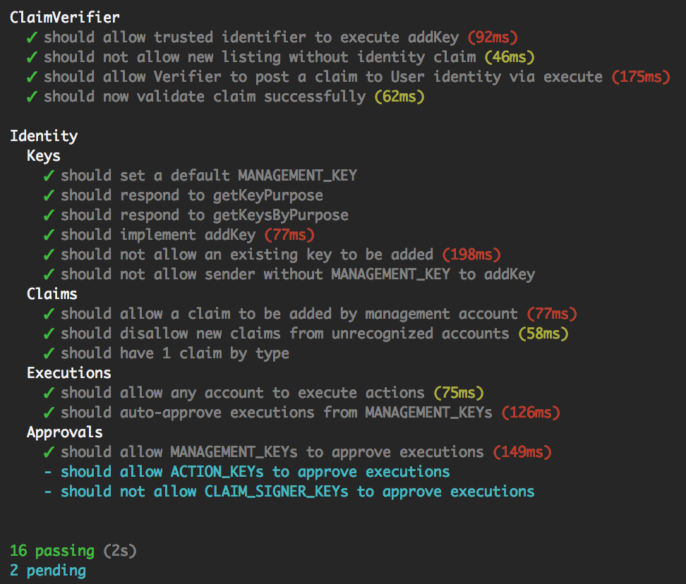

# ERC 725+735: Identity

## Installation

    npm install
    npm test

## Tests

## Contracts

- `KeyHolder.sol` - Implementation of ERC 725
- `ClaimHolder.sol` - Implementation of ERC 735
- `ClaimVerifier.sol` - Demonstrates how to verify a claim

## Notes

- Uses mocha for tests. Test files and contracts are watched for changes.

## Changes to the spec

- Uses `function getKey(bytes32 _key)` instead of `function getKey(bytes32 _key, uint256 _purpose)`
- Claim uses `bytes32 data` instead of `bytes data` to make implementation easier :-)

## Credits

Thanks to @JosefJ for his [original implementation](JosefJ/IdentityContract)
